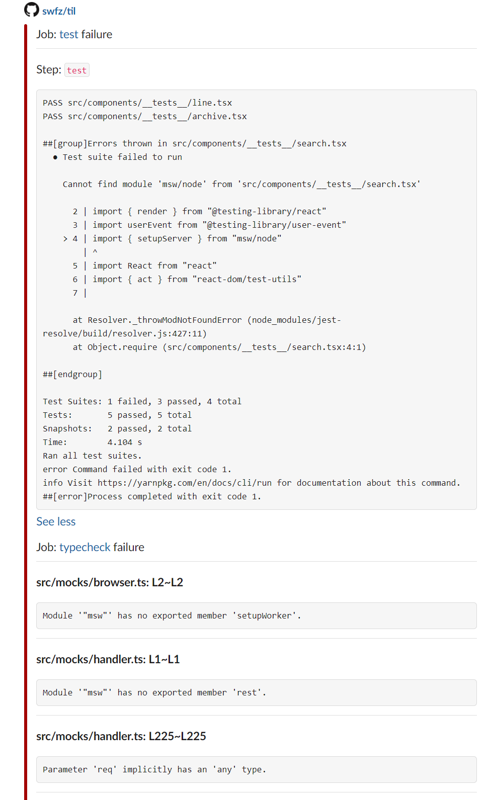

# Create a GitHub Action Using TypeScript

[](./badges/coverage.svg)

Custom action to notify Slack of the contents of the failure log or

annotation when an Actions workflow fails.

## Example


- `See more` clicked



## Usage

### call by workflow_run trigger

- .github/workflows/slack.yml

```yaml
name: slack notification

on:
  workflow_run:
    workflows:
      - ci
      - analysis
    types:
      - completed
jobs:
  main:
    name: main
    runs-on: ubuntu-latest
    steps:
      - uses: swfz/failed-log-to-slack-action@v1.1.0
        with:
          github-token: ${{ secrets.GITHUB_TOKEN }}
          slack-webhook-url: ${{ secrets.SLACK_WEBHOOK_URL }}
```

`ci`,`analysis` is other workflow name

run this workflow is there workflow completed

<!-- markdownlint-disable MD033 -->
<details>
  <summary>[deprecated] call by workflow configuration</summary>

- .github/workflows/xxxxx.yml

```yaml
name: ci

on: [push]

jobs:
  test:
  .....
  .....

  slack-notify:
    if: always()
    needs: [test]
    name: post slack
    runs-on: ubuntu-latest
    steps:
      - uses: swfz/failed-log-to-slack-action@v1.1.0
        with:
          github-token: ${{ secrets.GITHUB_TOKEN }}
          slack-webhook-url: ${{ secrets.SLACK_WEBHOOK_URL }}
```

If this Action is called in the same workflow configuration while the log file is being acquired,

the log file generation does not finish because the workflow is still running.

Therefore, the information obtained is less than that of the notification processed via `workflow_run`

because the information in the log file cannot be obtained.

</details>
<!-- markdownlint-enable MD033 -->

## Development

Enter the actual values you want to use.

```shell
export INPUT_GITHUB_TOKEN=xxxxx
export SLACK_WEBHOOK_URL=xxxxx

source script/dev_env.sh https://github.com/{owner}/{repo}/actions/runs/{run_id}
```

required `gh` command

Pass the URL of the GitHub Workflow execution result to the script

and set the environment variables necessary for development.

### simple execution

```shell
ts-node src/index.ts
```
